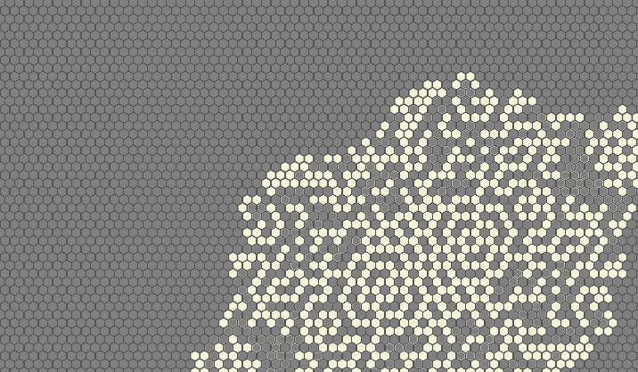

# Hex Game Of Life

[John Conway's game of life](https://www.wikiwand.com/en/Conway%27s_Game_of_Life)
but with hexagons.

## What's it about?

The whole gig is about managing a super basic universe that mimics life.
Simple rules order cells be brought to life, or be killed, depending on the amount of live neighbors.

